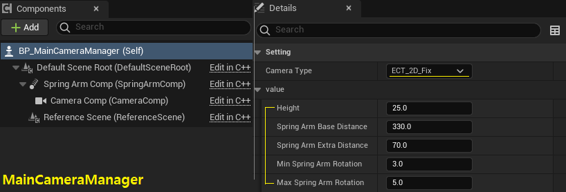
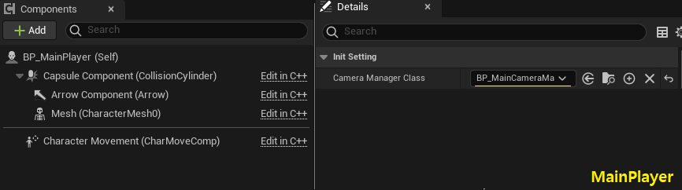
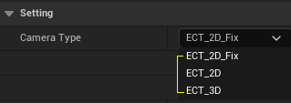
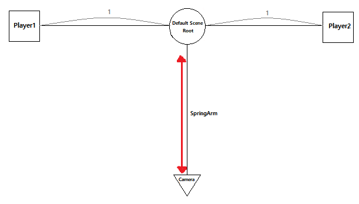
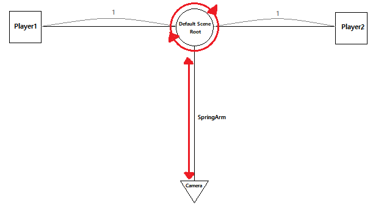
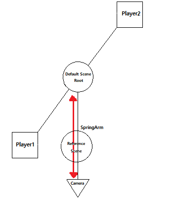

> # ActionCameraManager Plugin
  |<h3>__ActionCameraManger__</h3>|<h3>__Naurto__</h3>|
  |:--:|:--:|
  |||
  |개발한 액션 카메라의 움직임|참조한 나루토 얼티밋 스톰4 의 카메라의 움직임|

  |||
  |:--:|--|
  |작업 기간|2022.03.09 ~ 2022.04.03 (약 한달)|
  |인력 구성|1인 개발|
  |프로젝트 목적|대전 격투 게임을 제작하기 위해서 카메라 플러인을 찾는 도중 본인이 원하는 플러그인이 없다는 것을 확인하고, 직접 플러그인을 제작 & 배포하여 다른 개발자들에게 유용함을 주기 위하여 진행|
  |프로젝트 내용|이 플러그인은 2D, 3D와 같은 액션 격투 게임에 사용되는 카메라 관리자입니다. 이를 사용하면 카메라의 이동(뷰포트)을 자동으로 조작하여 플레이어들이 뷰포트에 항상 위치하도록 유지합니다. |
  |사용언어 및 개발 환경|C++, Unreal Engine(5.0.1), Visual Studio Community 2022, Window10|
  |참고 자료|[UnrealEngine MarketPlace](https://www.unrealengine.com/marketplace/en-US/product/6b542e9ad0b64686b1bf31dca9276316), [Preview Video](https://youtu.be/iWDMIVvR27I), [Setup Video](https://youtu.be/7N1cTe_sLFk), [Test Project](https://drive.google.com/file/d/1rqQjbcDdOxXinYIBNvA0E9hg38SsS1CW/view?usp=sharing)|

> ## 목차
1. [설명 (Description)](#설명-(Description))
2. [클래스 구성 (Configuration of class)](#클래스-구성-(Configuration-of-class))
3. [동작원리 (Operating Structure)](#동작원리-(Operating-Structure))
   1. [2D_Fix Mode](#2D_Fix-Mode)
   2. [2D Mode](#2D-Mode)
   3. [3D Mode](#2D-Mode)
4. [개선점 (Improvement points)](#개선점-(Improvement-points))

> ### **<h3>설명 (Description)</h3>**
  - ActionCameraManger 플러그인은 Takken7, Naruto Ulitimate Ninja Storm 4와 같은 __액션 배틀 게임에서 사용하는 로컬 카메라 플러그인입니다.__ 이 플러그인을 사용한다면 카메라의 조작을 MainCameraManager에서 자동으로 조작하기 때문에 개발자는 카메라에 대해서 개발을 진행할 필요가 없습니다. 이 카메라의 모드는 2D, 2D_fix, 3D로 총 3가지를 가지고 있습니다. 

  - 
  - 먼저 2D_Fix 모드는 카메라의 회전이 불가능하고, 거리(SpringArm Length)만 조정되기 때문에, 좌우로만 움직여 플레이하는 형식의 프로젝트에 유용합니다. 만약 좌우로만 움직이지 않고 상하방향으로 플레이어가 움직인다면 카메라에 플레이어를 담을 수 없습니다. 그 예시로는 Old Street Fighter2가 있습니다.

  - 
  - 다음으로 2D 모드는 카메라의 회전이 가능하고, 거리 또한 조정되기에 두 플레이어가 어디에 있던 뷰포트에 항상 두 플레이어를 모두 담을 수 있습니다. 하지만 두 플레이어의 좌우 위치가 바뀔때 카메라의 회전이 자연스럽지 않기 때문에, 주로 좌우로만 움직여 플레이하고 상하로는 조금씩만 움직여서 플레이하는 형식의 프로젝트에 유용합니다. 그 예시로는 Tekken7이 있습니다. 

  - 
  - 마지막으로 이 플러그인의 핵심인 3D 모드입니다. 이 모드는 겉으로 보기에는 2D와 비슷하지만 2D와는 다르게 카메라 회전에 있어 자연스러움을 보여주기 때문에 상하좌우 어디로든 자유롭게 움직여서 플레이하는 형식의 프로젝트에 유용합니다. 그 예시로는 Naruto Ulitimate Ninja Storm 4가 있습니다.

> ### **<h3>클래스 구성 (Configuration of class)</h3>**
  - ## MainCameraManager의 구성
  - 

    - MainCameraManager는 두 개의 SceneComponent, 한 개의 Camera/SpringArmComponent로 구성되어 있고, DefaultSceneRoot를 기준으로 다른 컴포넌트들이 부착되어있다.

    |Component|Explanation|
    |:--:|:--:|
    |__ScecnComponent__|각각 "두 플레이어의 중심 좌표","카메라와 가까운 플레이어의 주변 좌표(회전 시 참고)"를 표현하기 위해서 사용|
    |__SpringArm__|플레이어간의 거리가 변동될때 SpringArmLength를 조절하여 플레이어들을 모두 시야에 들어오도록 조정|
    |__Camera__|MainPlayer가 보게될 시점|

  - ## MainPlayer의 구성
  - 
    
    - MainPlayer는 기존 Character클래스와 동일하게 구성이 되어있으며, CameraComponent가 플레이어에게 직접 부착되지 않고, MainCameraManager의 컴포넌트를 사용한다.

    |Component|Explanation|
    |:--:|:--:|
    |__CapsulComponent__|물체의 충돌과 같은 이벤트를 감지할때 사용|
    |__ArrowComponent__|플레이어의 이동 방향을 표현하기 위해 사용|
    |__Mesh__|사용자에게 보이는 표면적인 부분으로 애니메이션 또한 담당|

> ### **<h3>동작원리 (Operating Structure)</h3>**
  - ### **모드의 구분**
  - 

    - 3가지의 모드를 구분하고 사용하기 위해서 열거형(enum)클래스를 사용하여 정의하고 사용하였다.

    <details><summary>Header File</summary> 

    ```c++
    //MainCameraManager.h
    UENUM(BlueprintType)
    enum class ECameraType : uint8 {
      ECT_2D_Fix		UMETA(DisplayName = "ECT_2D_Fix"),	  	//RootScene is Fix		        (EX : Street Fighter 2)
      ECT_2D				UMETA(DisplayName = "ECT_2D"),			    //RootScene is NonFix. For 2D (EX : Tekken 7)
      ECT_3D				UMETA(DisplayName = "ECT_3D")			      //RootScene is NonFix. For 3D (EX : Naruto shippuden Ultimate Ninja Storm 4)
    };

    protected:
    	UPROPERTY(EditAnywhere, Category = "Setting")
		  ECameraType CameraType;
    private:
    	FORCEINLINE ECameraType GetCameraType() { return CameraType; }
    ```
    </details>

  - ### **2D_Fix Mode**
  -  

    - 위 그림과 같이 P1과 P2의 중심에는 항상 Default(DefaultSceneRoot)가 배치되며, 이에는 SpringArm과 Camera가 부착되어 있기때문에 Default가 이동하면 같이 움직인다.
    - P1과 P2사이의 거리가 조정된다면 SpringArm의 길이와 회전 또한 조정하는데, 이는 모두 플레이어들을 화면상에 표현하기 위해서 사용한다.
    - Default의 위치만 변경될 뿐 회전은 진행되지 않는다.
      
      <details><summary>Cpp File</summary> 

      ```c++
      //MainCameraManager.cpp
      void AMainCameraManager::Tick(float DeltaTime) {
        Super::Tick(DeltaTime);

        CalculateVal();
      }
      void AMainCameraManager::CalculateVal() {
        SetCameraPosition();
      }
      void AMainCameraManager::SetCameraPosition() {
        /** DefaultSceneRoot의 위치 지정 */
        FVector DefaultLocation = (Players[0]->GetActorLocation() + Players[1]->GetActorLocation()) / 2.f;
        DefaultLocation.Z += Height;
        DefaultSceneRoot->SetWorldLocation(DefaultLocation);

        /** GlobalDistanceFactor(P1에서 P2의 거리)의 값을 지정 */
        float P1ToP2Distance = (Players[1]->GetActorLocation() - Players[0]->GetActorLocation()).Size() / 1200.f;
        GlobalDistanceFactor = UKismetMathLibrary::FClamp(P1ToP2Distance, 0.f, 1.f);

        /** GlobalDistanceFactor에 따라 SpringArm의 회전값, 위아래(Pitch)를 조정
         * 즉 P1과 P2가 멀어지면 카메라의 시점을 위로하여 두 플레이어가 시야에 모두 들어오도록 설정
         */
        float SpringPitch = UKismetMathLibrary::Lerp(MaxSpringArmRotation, MinSpringArmRotation, GlobalDistanceFactor) * -1.f;
        SpringArmComp->SetRelativeRotation(FRotator(SpringPitch, 0.f, 0.f));

        /** SpringArm의 길이를 지정 */
        FVector P1ToP2Vector = Players[1]->GetActorLocation() - Players[0]->GetActorLocation();
        P1ToP2Vector.Z = 0;
        float P1ToP2CenterLength = (P1ToP2Vector / 2.f).Size();
        float SpringArmLength = UKismetMathLibrary::Lerp(SpringArmBaseDistance, (SpringArmBaseDistance + SpringArmExtraDistance), GlobalDistanceFactor);
        SpringArmComp->TargetArmLength = P1ToP2CenterLength + SpringArmLength;
      }
      ```
      </details>

      <details><summary>Header File</summary> 
    
      ```c++
      //MainCameraManager.h
      protected:
        /** DefaultSceneRoot의 높이 */
        UPROPERTY(EditAnywhere, Category = "Setting|value")
        float Height = 25.f;

        /** SpringArm의 최대/최소 길이 */
        UPROPERTY(EditAnywhere, Category = "Setting|value")
        float SpringArmBaseDistance = 330.f;

        UPROPERTY(EditAnywhere, Category = "Setting|value")
        float SpringArmExtraDistance = 70.f;

        /** SpringArm의 최대/최소 상하각도(Pitch) */
        UPROPERTY(EditAnywhere, Category = "Setting|value")
        float MinSpringArmRotation = 3.f;

        UPROPERTY(EditAnywhere, Category = "Setting|value")
        float MaxSpringArmRotation = 5.f;
      private:
	      float GlobalDistanceFactor;			// P1과 P2 사이의 거리를 0 ~ 1의 비율로 변환

        void CalculateVal();
	      void SetCameraPosition();			  // SpringArm의 길이와 피치 값을 조정하여 수직 각도를 조정
      ```
      </details>
  
  - ### **2D Mode**
  -  

    - 기존 2D_Fix모드에서 DefaultSceneRoot의 회전이 추가된 모드이다.

      <details><summary>Cpp File</summary> 

      ```c++
      //MainCameraManager.cpp
      void AMainCameraManager::CalculateVal() {
        SetCameraPosition();

        /** Rotate the DefaultScene or adjust the ReferenceScene, if the CameraType matches */
        if (GetCameraType() == ECameraType::ECT_2D) {
          SetP1RelativeVal();
          RotateDefaultScene();
        }
      }
      void AMainCameraManager::SetP1RelativeVal() {
        FVector P1ToRoot_DirectionVec = UKismetMathLibrary::GetDirectionUnitVector(Players[0]->GetActorLocation(), DefaultSceneRoot->GetComponentLocation());
        P1ToRoot_InnerVec = UKismetMathLibrary::Dot_VectorVector(DefaultSceneRoot->GetRightVector(), P1ToRoot_DirectionVec);

        /** ReferenceScene를 기준으로 P1의 왼쪽(1) 및 오른쪽(-1) 위치를 식별 */
        FVector P1ToRef_DirectionVec = UKismetMathLibrary::GetDirectionUnitVector(Players[0]->GetActorLocation(), ReferenceScene->GetComponentLocation());
        float P1ToRef_InnerVec = UKismetMathLibrary::Dot_VectorVector(ReferenceScene->GetRightVector(), P1ToRef_DirectionVec);
        IsLeft = (P1ToRef_InnerVec <= 0.f) ? -1.f : 1.f;

        float P1ToCamera_Distance = (Players[0]->GetActorLocation() - CameraComp->GetComponentLocation()).Size();
        float P2ToCamera_Distance = (Players[1]->GetActorLocation() - CameraComp->GetComponentLocation()).Size();
        float P1ToP2_HalfDistance = ((Players[0]->GetActorLocation() - Players[1]->GetActorLocation()).Size()) / 2.f;

        /** Compare if P1 precedes P2 */
        IsForward = (P2ToCamera_Distance > P1ToCamera_Distance) ? 1.f : -1.f;
      }
      void AMainCameraManager::RotateDefaultScene() {
        float AbsInnerVal = FMath::Abs(P1ToRoot_InnerVec);

        if (AbsInnerVal <= 0.98f) {
          float Force = (0.98f - AbsInnerVal) * RotateForce;
          float YawForce = ((-IsForward * IsLeft) * Force) * UGameplayStatics::GetWorldDeltaSeconds(this);
          DefaultSceneRoot->AddWorldRotation(FRotator(0.f, YawForce, 0.f), false, false);
        }
      }
      ```
      </details>

      <details><summary>Header File</summary> 
    
      ```c++
      //MainCameraManager.h
      private:
        float IsForward;					// Based on the CameraComp, where is the P1 front(1) and back(-1)
	      float IsLeft;						// Based on the ReferenceScene, where is the P1 left(1) and right(-1)
	      float P1ToRoot_InnerVec;

        void SetP1RelativeVal();			// Determine where P1 is relative to P2 (front/back, left/right)
	      void RotateDefaultScene();			// Always set the ReferenceScene to always reside on the peripheral Y-axis of P1
      ```
      </details>

  - ### **3D Mode**
  -  
    - 2D Mode에서의 회전을 보면 자연스럽지 않다는 것을 확인할 수 있는데 이를 보완하기 위한 모드.
    - ReferenceScene라는 참조 컴포넌트를 추가하여 Root의 회전 시 참조하며, 이는 항상 P1과 동일한 X축에 위치한다.
      - ReferenceScene과 P1 사이의 거리가 일정거리만큼 멀어진다면 Reference가 P1의 방향으로 갈 수 있도록 Root에 회전을 더한다.

      <details><summary>Cpp File</summary> 

      ```c++
      //MainCameraManager.cpp
      void AMainCameraManager::CalculateVal() {
        SetCameraPosition();

        /** Rotate the DefaultScene or adjust the ReferenceScene, if the CameraType matches */
        if (GetCameraType() == ECameraType::ECT_3D || GetCameraType() == ECameraType::ECT_2D) {
          SetP1RelativeVal();
          RotateDefaultScene();

          if (GetCameraType() == ECameraType::ECT_3D) {
            SetReferenceScene();
            SetViewAllPlayers();

            /** Unnotate to view ReferenceScene's location. */
            DrawDebugSphere(GetWorld(), ReferenceScene->GetComponentLocation(), 10.f, 10.f, FColor::Green, false, 0.1f);
          }
        }
        /** Unnotate to view DefaultSceneRoot's location. */
        DrawDebugSphere(GetWorld(), DefaultSceneRoot->GetComponentLocation(), 10.f, 10.f, FColor::Red, false, 0.1f);		
      }
      void AMainCameraManager::SetReferenceScene() {
        float P1ToCamera_Distance = (Players[0]->GetActorLocation() - CameraComp->GetComponentLocation()).Size();
        float P2ToCamera_Distance = (Players[1]->GetActorLocation() - CameraComp->GetComponentLocation()).Size();
        float P1ToP2_HalfDistance = ((Players[0]->GetActorLocation() - Players[1]->GetActorLocation()).Size()) / 2.f;

        /** Place the X-axis of the ReferenceScene around the player closer to the camera */
        FVector Vec = (P2ToCamera_Distance > P1ToCamera_Distance) ? FVector(P1ToP2_HalfDistance * -1.f, 0.f, 0.f) : FVector(P1ToP2_HalfDistance, 0.f, 0.f);
        ReferenceScene->SetRelativeLocation(Vec);
      }
      void AMainCameraManager::RotateDefaultScene() {
        if (GetCameraType() == ECameraType::ECT_3D) {
          float P1ToReference_Length = (Players[0]->GetActorLocation() - ReferenceScene->GetComponentLocation()).Size();

          /** If the P1ToReference_Length is bigger than MinRotDistance, rotate DefaultSceneRoot */
          if (P1ToReference_Length >= MinRotDistance) {
            /** The strength of the force increases with distance. */
            float Force = (P1ToReference_Length - MinRotDistance) / RotationDelay;
            float YawForce = ((IsForward * IsLeft) * Force) * UGameplayStatics::GetWorldDeltaSeconds(this);
            DefaultSceneRoot->AddWorldRotation(FRotator(0.f, YawForce, 0.f), false, false);
          }
        }
      }
      void AMainCameraManager::SetViewAllPlayers() {
        /** If neither player has movement, check overlap */
        if (Players[0]->GetVelocity().Size() <= 0.1f && Players[1]->GetVelocity().Size() <= 0.1f) {
          float AbsInnerVal = FMath::Abs(P1ToRoot_InnerVec);
          if (AbsInnerVal < MinOverlapInnerVal && !bIsPlayersOverlap) bIsPlayersOverlap = true;

          /** Active SetNonOverlap() if Overlap*/
          if (bIsPlayersOverlap) SetNonOverlap();
        }
        else bIsPlayersOverlap = false;
      }
      void AMainCameraManager::SetNonOverlap() {
        float P1ToRootFactor = UKismetMathLibrary::FClamp((Players[0]->GetActorLocation() - DefaultSceneRoot->GetComponentLocation()).Size() / 800.f, 0.f, 1.f);
        float DeActiveRange = UKismetMathLibrary::Lerp(MaxOverlapInnerVal, MinOverlapInnerVal, P1ToRootFactor);	

        float YawForce = ((IsForward * IsLeft) * (OverlapRotateForce * DeActiveRange)) * UGameplayStatics::GetWorldDeltaSeconds(this);
        DefaultSceneRoot->AddWorldRotation(FRotator(0.f, YawForce, 0.f), false, false);

        /** Exits if it exceeds the internal value of the schedule */
        if (FMath::Abs(P1ToRoot_InnerVec) >= DeActiveRange)  bIsPlayersOverlap = false;
      }
      ```
      </details>

      <details><summary>Header File</summary> 
    
      ```c++
      //MainCameraManager.h
      private:
      	/** Variables used in 3D */
        float MinRotDistance = 145.f;		// Maximum distance between P1 and ReferenceScene (Rotate if over value)
        float RotationDelay = 4.f;
        
        /** Related to Overlap */
        bool bIsPlayersOverlap = false;
        float MaxOverlapInnerVal = 0.5f;	// Max/Minimum Inner value of DefaultSceneRoot and P1
        float MinOverlapInnerVal = 0.07f;
        float OverlapRotateForce = -35.f;

        void RotateDefaultScene();			// Always set the ReferenceScene to always reside on the peripheral Y-axis of P1
        void SetViewAllPlayers();			// Automatic rotation if P1 and P2 overlap each other based on the camera's perspective
	      void SetNonOverlap();				// If bIsPlayersOverlap is True, rotate the camera to prevent players from overlapping.
      ```
      </details>

  - ### **플레이어의 이동**
    - 플레이어는 BeginPlay()에서 MainCameraManager를 월드에서 찾아, 매 Tick()마다 컨트롤러의 Rotation(시점)을 MainCameraManager와 동일하게 설정한다.
    - 플레이어의 시점은 곧 카메라의 시점이기 때문에 MoveForward/Right()메서드에서 이를 기준으로 이동을 계산한다.

      <details><summary>Cpp File</summary> 

      ```c++
      //MainPlayer.cpp
      void AMainPlayer::Tick(float DeltaTime) {
        Super::Tick(DeltaTime);

        /** Setting the rotation of the controller according to the rotation of the CameraManager */
        if (CameraManager) {
          FRotator NRot = FRotator(CameraManager->GetActorRotation().Pitch, CameraManager->GetActorRotation().Yaw, GetController()->GetControlRotation().Roll);
          GetController()->SetControlRotation(NRot);
        }
      }
      void AMainPlayer::MoveForward(float Value) {
        FRotator Rot = FRotator(0.f, GetControlRotation().Yaw, 0.f);
        AddMovementInput(UKismetMathLibrary::GetForwardVector(Rot), Value);
      }
      void AMainPlayer::MoveRight(float Value) {
        FRotator Rot = FRotator(0.f, GetControlRotation().Yaw, 0.f);
        AddMovementInput(UKismetMathLibrary::GetRightVector(Rot), Value);
      }
      ```
      </details>
      <details><summary>Header File</summary> 

      ```c++
      //MainPlayer.h
      protected:
        /** The player moves based on the rotation of the CameraManager */
        void MoveForward(float Value);
        void MoveRight(float Value);

        /** MainCameraManager class to find */
        UPROPERTY(EditDefaultsOnly, Category = "InitSetting")
        TSubclassOf<AActor> CameraManagerClass;

        class AMainCameraManager* CameraManager;
      ```
      </details>

> ### **<h3>개선점 (Improvement points)</h3>**
  - 조만간 OpenSource를 공부하여 올릴 예정이다. 그렇게 된다면 더욱 더 나은 플러그인이 되지 않을까?